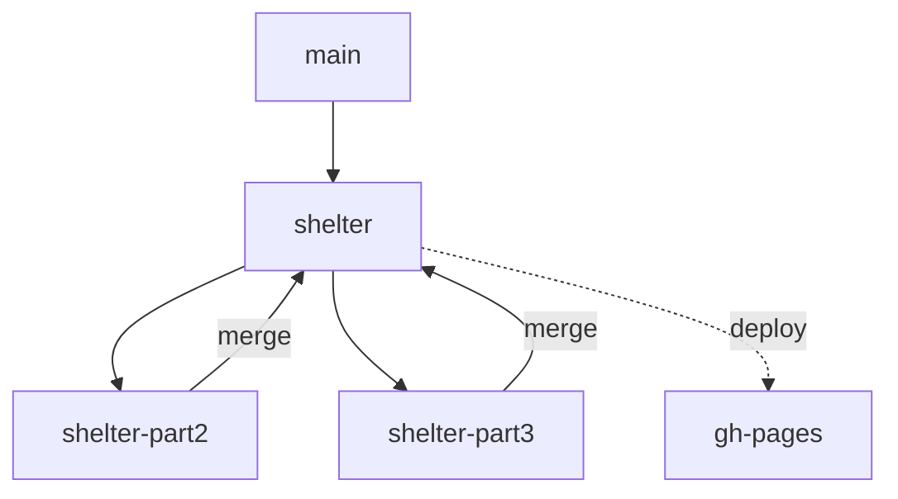
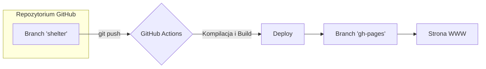

Aby poprawnie zarządzać tym projektem zgodnie z wymaganiami technicznymi, przygotowałem dwa diagramy. Pierwszy obrazuje strukturę branchy (jak przechodzić przez kolejne części zadania), a drugi proces wdrażania zmian (deploy).

### 1. Schemat pracy na branchach (Part 1, 2, 3)

Ten schemat pokazuje, jak rozwijać projekt, tworząc osobne branche dla kolejnych etapów, zgodnie z instrukcją "Never merge into main".

### 2. Proces automatycznego deployu (GitHub Actions)

Jeśli zdecydujesz się na automatyzację, każdy `git push` na odpowiedni branch automatycznie aktualizuje Twoją stronę na `gh-pages`.

---

### Praktyczne przypomnienia:

* 
**Struktura folderów**: Pamiętaj, że wewnątrz brancha `shelter` musisz utworzyć folder o nazwie `shelter` i tam umieścić wszystkie pliki projektu.

* 
**Deployment**: Zgodnie z wymaganiami, `gh-pages` służy do hostowania pracy. Jeśli używasz metody ręcznej, po każdej ważnej zmianie tworzysz PR z `shelter` do `gh-pages`, aby opublikować efekt końcowy.

* 
**Ważne**: Nie zapomnij o dodaniu pliku `index.js` z `console.log()` zawierającym Twoją samoocenę – jest to wymagane technicznie do zaliczenia zadania.